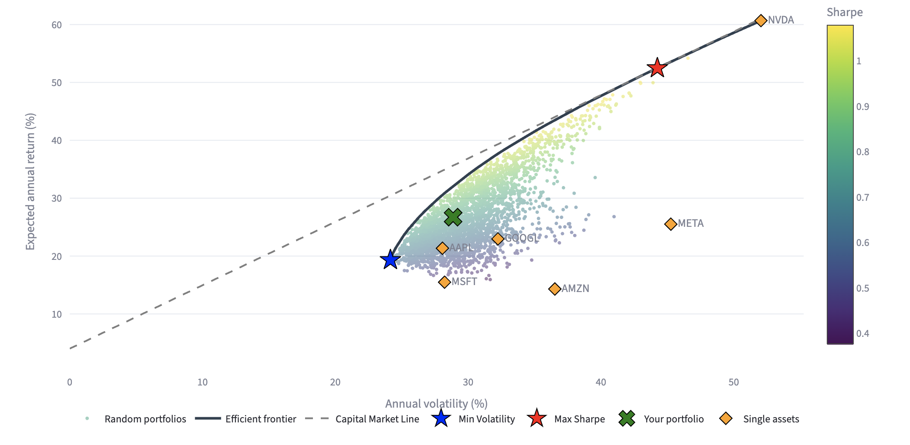
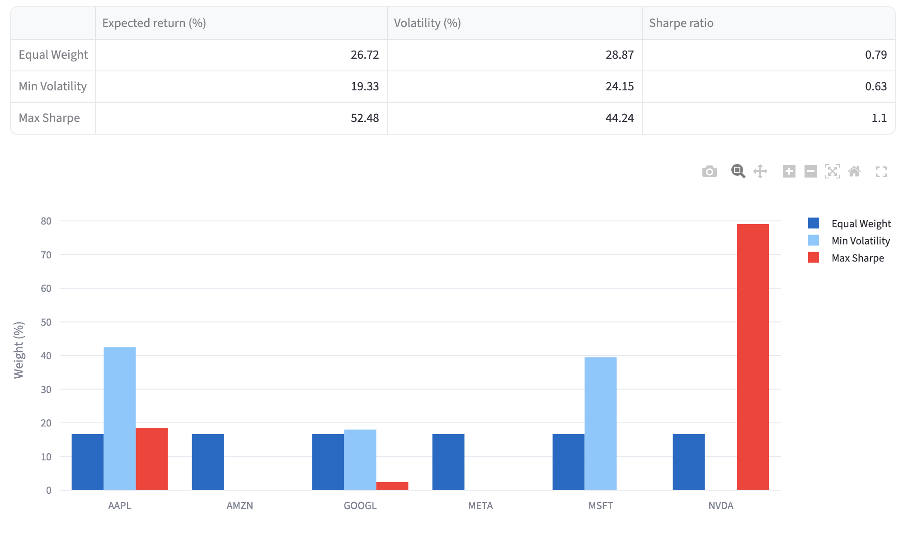
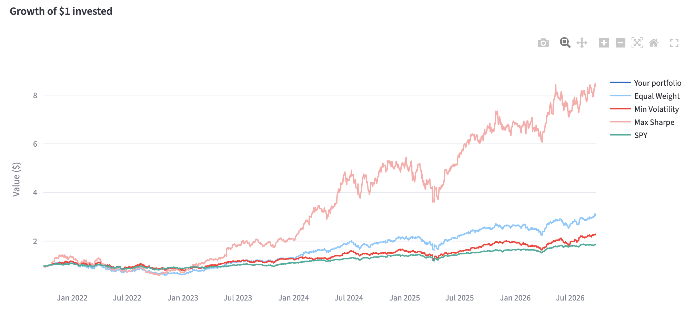
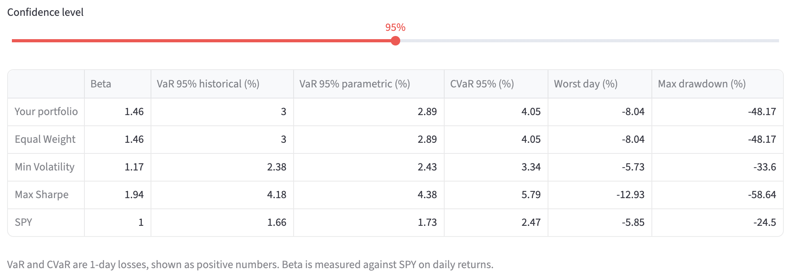
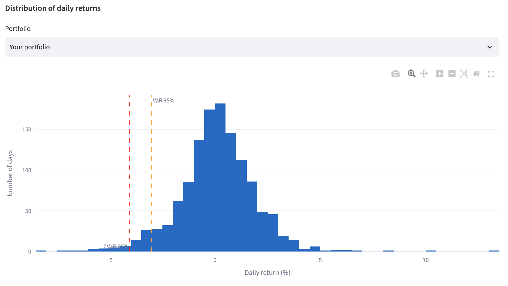

# 📈 Portfolio Optimizer

A Python web app for **mean-variance portfolio analysis and optimization**, built with Streamlit.

Select a set of stocks and a time period: the app downloads historical market data and applies Modern Portfolio Theory to analyze risk and return, build optimized portfolios and compare them with the S&P 500.

> Educational project built to apply the quantitative portfolio theory studied in my Finance degree. It is not investment advice.

**Live demo:** _coming soon_



---

## Features

- **Market data**: adjusted prices from Yahoo Finance, with validation of tickers, missing values and period length
- **Asset analysis**: cumulative return, mean annual return, CAGR and annualized volatility
- **Correlation**: correlation heatmap, annualized covariance matrix and average pairwise correlation
- **Optimization** (long-only, fully invested, optional max weight per asset):
  - Equal Weight
  - Minimum Volatility
  - Maximum Sharpe Ratio
- **Efficient frontier**: exact frontier, 3,000 random portfolios and the Capital Market Line
- **Custom portfolio**: set your own weights and see where they sit on the frontier
- **Benchmark**: comparison with SPY: growth of $1, CAGR, volatility, Sharpe ratio and drawdowns
- **Risk metrics**: beta, historical and parametric Value at Risk, CVaR (Expected Shortfall), worst day, maximum drawdown
- **Robust input handling**: invalid tickers, short periods, single asset and data download failures are handled without crashing

## Screenshots

| Optimal portfolios | Benchmark comparison |
|---|---|
|  |  |




## Financial methodology

All estimates use **simple daily returns** on adjusted prices (splits and dividends included), annualized with **252 trading days**.

| Metric | Formula |
|---|---|
| Daily return | $r_t = P_t / P_{t-1} - 1$ |
| Expected annual return | $\mu = \bar{r}_{daily} \times 252$ |
| Annual volatility | $\sigma = \sigma_{daily} \times \sqrt{252}$ |
| Covariance matrix | $\Sigma = \text{Cov}(r_{daily}) \times 252$ |
| Portfolio return | $R_p = w^\top \mu$ |
| Portfolio volatility | $\sigma_p = \sqrt{w^\top \Sigma w}$ |
| Sharpe ratio | $(R_p - R_f) / \sigma_p$ |
| Beta | $\text{Cov}(r_p, r_m) / \text{Var}(r_m)$ |
| Maximum drawdown | $\min_t \left( V_t / \max_{s \le t} V_s - 1 \right)$ |

**Why $\sqrt{w^\top \Sigma w}$ and not a weighted average of volatilities?** Portfolio risk depends on how assets move together. With correlations below 1, portfolio volatility is lower than the weighted average of single-asset volatilities: this is the diversification benefit, and the app shows it explicitly.

**Optimization.** Portfolios are found numerically with `scipy.optimize.minimize` (SLSQP), subject to:

$$\sum_i w_i = 1, \qquad 0 \le w_i \le w_{max}$$

- *Minimum Volatility* minimizes $\sqrt{w^\top \Sigma w}$ and depends only on the covariance matrix.
- *Maximum Sharpe* minimizes the negative Sharpe ratio. It is the tangency point between the efficient frontier and the Capital Market Line.
- The *efficient frontier* is built by minimizing volatility for 40 target returns.

**Risk metrics.** Historical VaR is the empirical percentile of daily returns. Parametric VaR assumes normally distributed returns, $-(\mu + z_\alpha \sigma)$. CVaR is the average loss on the days worse than the VaR. VaR and CVaR are 1-day measures, shown as positive losses.

## Limitations

This is a learning project, and its results should be read with these limitations in mind:

- **Historical estimates**: expected returns are historical averages, which are noisy and a weak predictor of future returns.
- **In-sample bias**: optimized portfolios are built and evaluated on the same data, so their performance against the benchmark is optimistic.
- **Estimation error**: mean-variance optimization is very sensitive to expected returns and tends to concentrate on the best past performers. The max-weight constraint partially mitigates this.
- **Simplifying assumptions**: constant weights with daily rebalancing, no transaction costs or taxes, constant risk-free rate.
- **Normality**: volatility and parametric VaR do not capture fat tails. Historical VaR and CVaR are included for this reason.
- **Data source**: `yfinance` is an unofficial Yahoo Finance API, useful for prototyping but not a professional data feed.

## Tech stack

| Area | Tools |
|---|---|
| Language | Python |
| Web app | Streamlit |
| Data | pandas, NumPy, yfinance |
| Optimization | SciPy |
| Charts | Plotly |

## Project structure

```
portfolio-optimizer/
├── app.py               # Streamlit dashboard (UI only)
├── requirements.txt
├── docs/                # screenshots
└── src/
    ├── data.py          # download, validation and cleaning of market data
    ├── portfolio.py     # return, risk and performance metrics
    └── optimization.py  # optimizers, efficient frontier, random portfolios
```

The financial logic in `src/` is independent of the interface: every function can be reused in a notebook or another app.

## Installation

Requires Python 3.10 or newer.

```bash
git clone https://github.com/gianmariagrespan7-web/portfolio-optimizer.git
cd portfolio-optimizer
python3 -m venv .venv
source .venv/bin/activate        # Windows: .venv\Scripts\activate
pip install -r requirements.txt
streamlit run app.py
```

The app opens at `http://localhost:8501`.

## Usage

1. Enter tickers in the sidebar (e.g. `AAPL, MSFT, NVDA, KO`) and choose a period.
2. Set the risk-free rate (for USD assets, the 3-month US T-bill yield).
3. Optionally cap the maximum weight per asset.
4. Explore the tabs: asset performance, correlation, efficient frontier, optimal portfolios, your custom portfolio, benchmark and risk metrics.

## Future improvements

- Out-of-sample **walk-forward backtest** to evaluate the strategies on unseen data
- Transaction costs and a choice of rebalancing frequency (monthly, quarterly)
- Shrinkage covariance estimators (e.g. Ledoit-Wolf) to reduce estimation error
- Black-Litterman model to combine market equilibrium with investor views
- Sector and asset-class constraints, and benchmarks beyond SPY
- Unit tests for the financial functions

## Author

**Gianmaria Grespan**, MSc in Finance student at Università della Svizzera italiana (USI), Lugano.

[LinkedIn](https://www.linkedin.com/in/YOUR-PROFILE) · [GitHub](https://github.com/gianmariagrespan7-web)

---

*Disclaimer: for educational purposes only. Nothing in this project is investment advice.*